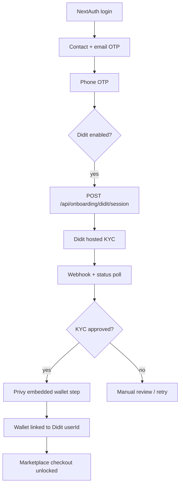
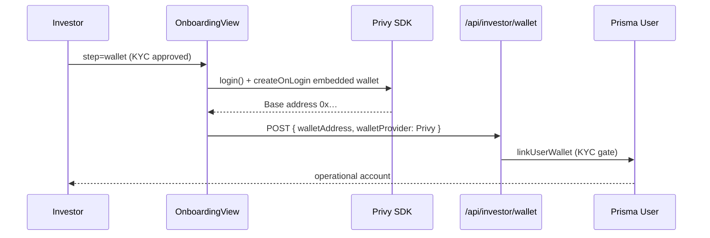
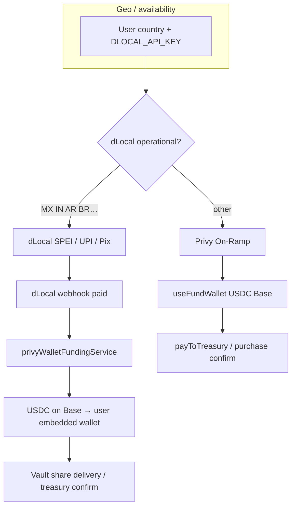
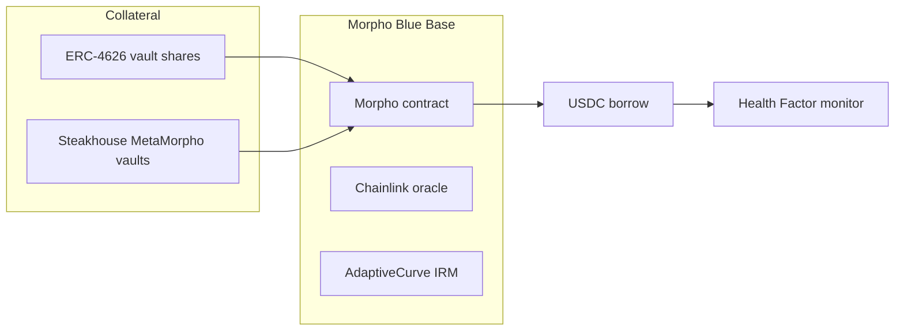
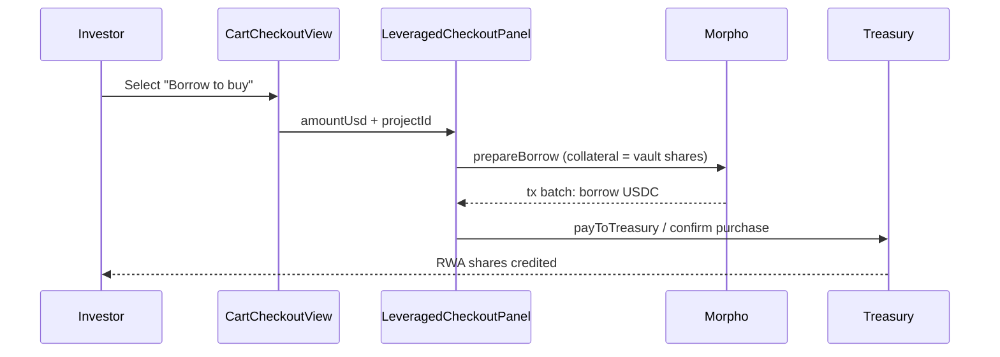

# Sanova Global — Web3 Onboarding, Payments & Lending Architecture

> **Stack:** Base L2 · Didit (KYC) · Privy (embedded wallets) · dLocal → Privy On-Ramp · Morpho Blue · Steakhouse vaults

## 1. Identity & compliance layer (Didit — preserved)

Didit remains the **sole KYC / Proof of Humanity** provider. NextAuth handles platform login; Didit runs **after** email + phone verification.

**Backend gates:** `kycStatus === APPROVED'` required via `linkUserWallet()` and `requireMorphoBorrowSession()`.

**Files:**
- `apps/web/src/lib/onboarding/diditService.ts`
- `apps/web/src/components/kyc/OnboardingView.tsx`
- `apps/web/src/app/api/onboarding/didit/*`

---

## 2. Privy embedded wallet (post-KYC)

After Didit approval, **Privy is the exclusive wallet provider** for investors (no external wallet required).

**Gas abstraction:** Configure **Privy Dashboard → Gas sponsorship** for Base. Client config sets `createOnLogin: 'users-without-wallets'` and minimizes signature prompts.

**Files:**
- `apps/web/src/lib/privy/config.ts`
- `apps/web/src/components/kyc/PrivyOnboardingWallet.tsx`
- `apps/web/src/hooks/usePrivyEmbeddedWallet.ts`

---

## 3. Payment cascade (dLocal → Privy On-Ramp)

| Priority | Rail | User sees | Backend |
|----------|------|-----------|---------|
| 1 | dLocal | Local fiat (SPEI, UPI, Pix) | Webhook → auto USDC credit to Privy wallet |
| 2 | Privy On-Ramp | Card / Apple Pay | Client fund → treasury settlement |

**Policy:** `paymentRoutePolicy.ts`, `privyOnRampPolicy.ts`, `dlocalCountryCoverage.ts`

**Settlement:** `fiatRailTreasurySettlement.ts` + `privyWalletFundingService.ts`

---

## 4. Morpho Blue + Steakhouse vaults

**Steakhouse:** Curator vault addresses on Base via `STEAKHOUSE_VAULT_ADDRESSES` (comma-separated). Routing prefers Steakhouse MetaMorpho when configured.

**Health factor:** `morphoHealthFactor.ts` — reads borrow/supply shares, LLTV, collateral USD → HF = collateral×LLTV / debt.

**API routes:**
- `GET /api/lending/health-factor`
- `POST /api/lending/borrow-preview`
- `POST /api/lending/prepare`
- `POST /api/marketplace/cart/leveraged-checkout`

---

## 5. Leveraged purchase flow

**Single signing path:** Privy embedded wallet executes prepared tx batch via `executePreparedTransactionsWithWalletClient`.

---

## Environment checklist

| Variable | Purpose |
|----------|---------|
| `DIDIT_*` | KYC sessions + webhooks |
| `NEXT_PUBLIC_PRIVY_APP_ID` | Client embedded wallets |
| `PRIVY_APP_SECRET` | Server earn / funding API |
| `PRIVY_VAULT_ID` | Privy Earn vault |
| `DLOCAL_*` | Local rails priority |
| `MORPHO_*` / `METAMORPHO_*` | Lending contracts |
| `STEAKHOUSE_VAULT_ADDRESSES` | Steakhouse curator vaults |
